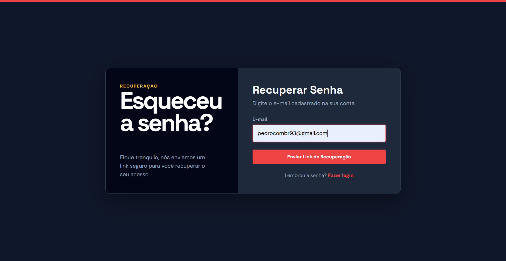
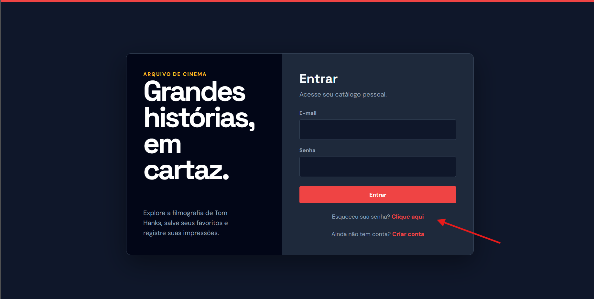
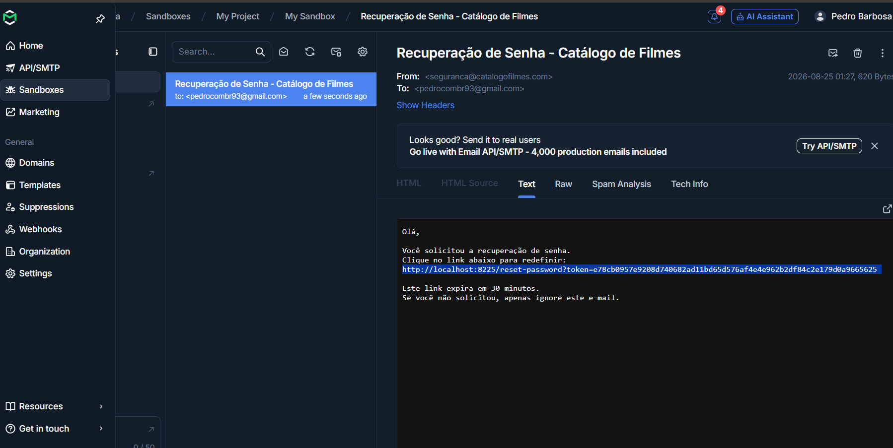
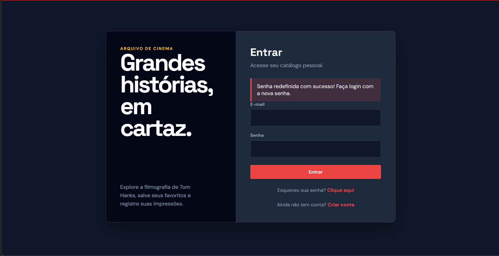
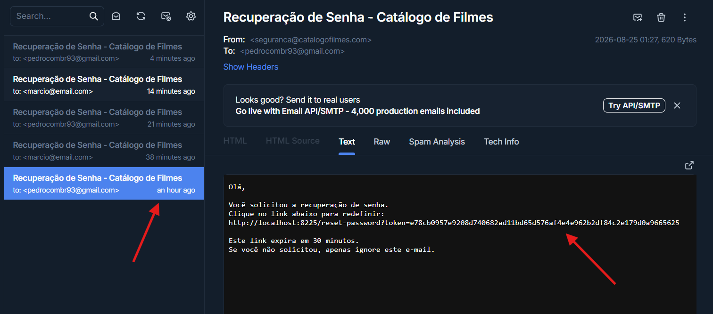

# Catálogo de Filmes - Microsserviços e Autenticação

Atualização da arquitetura para a Atividade 3, implementando um serviço isolado de autenticação e comunicação via rede interna do Docker.

**Professor:** 

## 🏗️ O que mudou na Arquitetura?

1. **Serviço de Autenticação Isolado:** Todo o fluxo de login, cadastro, papéis de usuário (role) e recuperação de senha foi extraído do catálogo e movido para um novo container dedicado (`auth_api`).
2. **Rede Interna Segura:** O serviço de autenticação **não possui portas publicadas para o host**. O catálogo é o único ponto de entrada público. Toda a comunicação entre o catálogo e a autenticação ocorre invisível para a internet, utilizando o DNS interno do Docker.
3. **Recuperação de Senha com SMTP Real:** Implementação da geração de tokens seguros (32 bytes) com expiração de 30 minutos, armazenados no banco de dados. O envio de e-mails de recuperação é feito de forma real via porta 2525 utilizando o ambiente de desenvolvimento Mailtrap.

## 🐳 Configuração do Docker (docker-compose.yml)

Abaixo, a demonstração de como os serviços estão isolados na mesma rede, garantindo que o `auth_api` não exponha portas externas:

```yaml
services:
  catalogo_web:
    build: ./catalogo_service
    ports:
      - "8225:5000" # ÚNICO PONTO PÚBLICO
    environment:
      - FLASK_SECRET_KEY=${FLASK_SECRET_KEY}
    depends_on:
      - db
      - auth_api
    networks:
      - rede_catalogo

  auth_api:
    build: ./auth_service
    # SEM PORTAS EXPOSTAS (sem diretiva 'ports')
    environment:
      - DB_HOST=${DB_HOST}
      - DB_USER=${DB_USER}
      - DB_PASSWORD=${DB_PASSWORD}
      - DB_NAME=${DB_NAME}
      - MAIL_SERVER=${MAIL_SERVER}
      - MAIL_PORT=${MAIL_PORT}
      - MAIL_USERNAME=${MAIL_USERNAME}
      - MAIL_PASSWORD=${MAIL_PASSWORD}
    depends_on:
      - db
    networks:
      - rede_catalogo
      
networks:
  rede_catalogo:
    driver: bridge


 ## 📸 Demonstração Completa do Fluxo de Recuperação de Senha

### 1. Pedido de Recuperação
Telas do pedido de redefinição de senha no sistema:

.png)

.png)

### 2. E-mail Recebido (Mailtrap)
O e-mail simulado contendo o link de redefinição:


### 3. Redefinição Concluída com Sucesso
A confirmação de que a senha foi alterada com sucesso:


### 4. Tentativa Recusada (Token Inválido ou Expirado)
A segurança bloqueando o uso de links incorretos ou expirados:

.png)