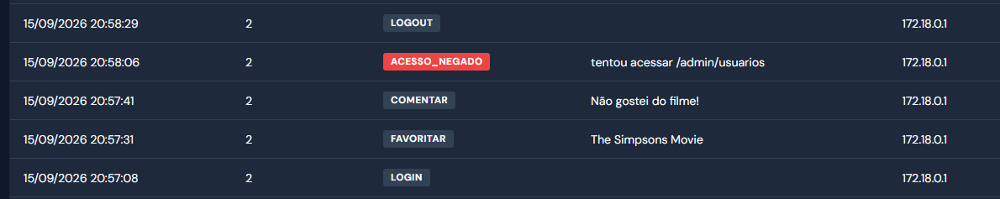

# 🎬 Catálogo de Filmes — Microsserviços, Autenticação e Papéis de Admin

Aplicação web de catálogo de filmes (filmografia de Tom Hanks, via API do TMDB) onde usuários cadastrados podem favoritar filmes e comentar. Construída como microsserviços separados em containers Docker, com um serviço de autenticação isolado, um sistema de papéis (`usuario` / `admin`) com moderação, gestão de acessos e métricas, e um serviço de auditoria com Redis.

Projeto desenvolvido para a disciplina do professor [@siriani](https://github.com/siriani) 
**Ambiente publicado:** `https://pedro-ferreira-isw055.lapps.studio`

---

## 🏗️ Arquitetura

A aplicação é dividida em serviços independentes, cada um no seu container, comunicando-se pela rede interna do Docker:

```
                    Internet
                        │
                        ▼
              ┌───────────────────┐
              │   catalogo_web     │  ← único ponto público (porta 8225)
              │  (Flask, templates)│
              └───┬───────────┬────┘
                   │           │ rede interna Docker
                   │           │ (sem porta exposta)
                   ▼           ▼
      ┌───────────────────┐  ┌───────────────────┐
      │     auth_api       │  │    log_service     │
      │  (Flask, sem UI)   │  │  (Flask, sem UI)   │
      └─────────┬──────────┘  └─────────┬──────────┘
                 │                       │
                 ▼                       ▼
      ┌───────────────────┐   ┌───────────────────┐
      │   MySQL externo    │   │   Redis Stream     │
      │  (usuarios, favo-  │   │   "auditoria"      │
      │  ritos, comentá-   │   │  (XADD / XREVRANGE)│
      │  rios, reset_...)  │   └───────────────────┘
      └───────────────────┘
```

- **`catalogo_service` (`catalogo_web`)**: único serviço com porta publicada para fora (`8225:5000`). Serve as páginas (catálogo, login, cadastro, telas de admin), guarda a sessão do usuário logado, fala com o `auth_api` quando precisa (login, cadastro, recuperação de senha, gestão de papéis) e manda cada ação relevante pro `log_service`.
- **`auth_service` (`auth_api`)**: **não tem porta publicada para o host** — só é alcançável pela rede interna do Docker (`http://auth_api:5001`). Concentra tudo relacionado a identidade: cadastro, login, papéis (`role`), exclusão de usuário, recuperação de senha com envio de e-mail real via Mailtrap.
- **`log_service`**: também **sem porta publicada** — recebe eventos de auditoria do `catalogo_web` e grava num Redis Stream. Não sabe nada sobre permissões ou regras de negócio, só registra e devolve o que já aconteceu.
- **Banco de dados**: MySQL **externo**, fora do `docker-compose.yml` (endereço configurado em `.env` via `DB_HOST`), compartilhado pelos serviços de dado.
- **Redis**: também dentro do `docker-compose.yml`, sem porta publicada, guarda só o histórico de eventos (não é dado de negócio).

---

## ✨ Funcionalidades

### Catálogo (todo usuário logado)
- Navega pela filmografia de Tom Hanks (busca via API pública do TMDB).
- Favorita/desfavorita filmes.
- Comenta em filmes — os comentários aparecem para todos, com o nome de quem comentou.
- Apaga os **próprios** comentários.

### Conta
- Cadastro (`/register`) — todo novo usuário nasce com `role = usuario`.
- Login (`/login`) — sessão baseada em cookie assinado (Flask session).
- Recuperação de senha (`/forgot-password` → `/reset-password`) — token seguro de 32 bytes, expira em 30 minutos, enviado por e-mail real via Mailtrap (SMTP, porta 2525).

### Administração (exclusivo de `admin`)
- **Moderação de comentários**: apaga o comentário de **qualquer usuário** (não só os próprios) — útil pra remover spoiler ou xingamento.
- **Gestão de papéis**: tela (`/admin/usuarios`) que lista todos os usuários cadastrados e permite promover (`usuario` → `admin`) ou rebaixar (`admin` → `usuario`) qualquer um.
- **Excluir usuário**: na mesma tela de gestão de papéis, remove definitivamente um usuário e todos os dados ligados a ele (favoritos, comentários, tokens de recuperação de senha) — `POST /admin/usuarios/<id>/deletar`. Um admin **não pode apagar a própria conta** enquanto estiver logado (bloqueio próprio, pra evitar se auto-excluir e ficar sem acesso).
- **Dashboard de métricas** (`/admin/metricas`): total de usuários cadastrados, total de favoritos, filmes distintos favoritados, total de comentários e a quebra de usuários por papel.
- **Logs de auditoria** (`/admin/logs`): consulta os últimos eventos do sistema — login, logout, favoritar, comentar, moderação e tentativas de acesso negado — na ordem do mais recente pro mais antigo.

---

## 🔐 Permissões por papel

### `usuario` (padrão de todo cadastro novo) pode:
- Navegar pelo catálogo de filmes.
- Adicionar e remover favoritos.
- Comentar em filmes.
- Apagar **exclusivamente os próprios comentários**.

### `admin` herda tudo isso e, além disso, pode:
- **Moderação de comentários**: apagar o comentário de **qualquer usuário** — `POST /deletar-comentario/<id>`.
- **Gestão de papéis**: listar todos os usuários e promover/rebaixar o `role` de qualquer um — `GET /admin/usuarios` e `POST /admin/usuarios/<id>/role`.
- **Excluir usuário**: apagar definitivamente qualquer conta (exceto a própria) — `POST /admin/usuarios/<id>/deletar`.
- **Dashboard de métricas**: ver o relatório interno — `GET /admin/metricas`.
- **Logs de auditoria**: consultar o histórico de ações do sistema — `GET /admin/logs`.

---

## 🛡️ Enforcement das ações de admin

Todas as checagens abaixo rodam **no backend**, a partir do `role` do usuário autenticado (guardado na sessão assinada do Flask, recebida do `auth_api` no login) — nunca dependem de nada que a interface esconda, então funcionam igual clicando na tela ou chamando o endpoint direto:

- **`POST /deletar-comentario/<id>`**: permite se o usuário é o **autor** do comentário OU **admin**; qualquer outro caso → `403`.
- **`GET /admin/usuarios`**, **`POST /admin/usuarios/<id>/role`**, **`POST /admin/usuarios/<id>/deletar`**, **`GET /admin/metricas`**, **`GET /admin/logs`**: só permitem se `role == 'admin'` (decorator `@admin_required`); qualquer outro caso → `403` (ou `401` se nem estiver logado).

A gestão de papéis e a exclusão de usuário são divididas em duas pontas: o `catalogo_web` (único ponto público) faz a checagem de admin e delega a alteração de fato para endpoints internos do `auth_api` (`GET /usuarios`, `PUT /usuarios/<id>/role`, `DELETE /usuarios/<id>`) — que não têm porta exposta pra internet, só acessíveis pela rede interna do Docker, então continuam invisíveis de fora mesmo sem checagem própria de role. A exclusão em si apaga primeiro os favoritos, comentários e tokens de reset do usuário (pra não violar as chaves estrangeiras) e só depois o usuário.

---

## 📋 Logs e Auditoria

Continuação da atividade de controle de acesso: agora toda ação relevante do sistema deixa um rastro — quem fez, o quê, e quando.

### Por que um microsserviço próprio, e por que Redis

O `log_service` é mais um container, na mesma rede interna do Docker, **sem porta publicada pro host** — mesmo princípio do `auth_api`. Ele não sabe nada sobre regras de negócio ou permissões: só recebe eventos e grava. Quem decide o quê logar é sempre o `catalogo_web`, porque é ele quem tem a sessão do usuário logado.

Log de auditoria tem um padrão de uso bem diferente de dado de negócio: escreve muito, lê pouco, sem transação complexa. Por isso não fica no MySQL — vai pro **Redis Streams** (`XADD` para gravar, `XREVRANGE` para consultar os mais recentes primeiro), estrutura pensada exatamente pra esse tipo de log ordenado no tempo.

### Eventos registrados

| Ação | Onde é disparado |
|---|---|
| `login` | Depois de autenticar com sucesso no `auth_api` |
| `logout` | Antes de limpar a sessão |
| `favoritar` / `desfavoritar` | Ao adicionar/remover um favorito |
| `comentar` | Ao publicar um comentário |
| `apagar_comentario` | Ao apagar um comentário — o `detalhe` diz se foi `(próprio)` ou `(moderação)` |
| `acesso_negado` | Toda vez que uma rota de admin barra um usuário comum com `403` — tanto o decorator `@admin_required` quanto o `403` manual da moderação de comentário registram isso |

Cada evento grava `usuario_id`, `acao`, `detalhe`, `ip` (bônus) e `timestamp` (convertido pro horário de Brasília, UTC-3, na exibição).

### Consultar os logs — só admin

`GET /admin/logs` (aceita `?n=` pra mudar quantos eventos trazer, padrão 50) — protegida pelo mesmo `@admin_required` das outras telas de admin: um `usuario` comum recebe `403` igual às demais.

### Demonstração

1. Login com um usuário comum → aparece `login` no log.
2. Favoritar um filme → aparece `favoritar`.
3. Comentar → aparece `comentar`.
4. Tentar acessar `/admin/usuarios` sem ser admin → aparece `acesso_negado` (e a tela mostra `403`, igual antes).
5. Logout → aparece `logout`.
6. Logar como admin, abrir `/admin/logs` → todos os eventos acima aparecem, do mais recente pro mais antigo.

| Sequência completa (usuário comum) |
|---|
|  |

---

## 🧪 Demonstração prática — controle de acesso

O domínio público (`https://pedro-ferreira-isw055.lapps.studio`) fica atrás de um desafio anti-bot do Cloudflare, que barra requisições automatizadas sem navegador (curl, Postman) antes mesmo de chegar na aplicação. Por isso, a demonstração foi feita de duas formas, dependendo do alvo:

### Pelo navegador, direto no domínio público (forma usada aqui)

Login como usuário comum e como admin, acessando a mesma rota digitando a URL direto na barra de endereço (sem clicar em nenhum botão da interface):

1. Logado como `usuario` (Marcio), acessar `https://pedro-ferreira-isw055.lapps.studio/admin/usuarios` → retorna `{"erro": "Ação restrita a administradores."}`, HTTP `403`.
2. Logado como `admin` (Pedro), acessar a mesma URL → carrega a tela de Gestão de Papéis normalmente, HTTP `200`.

Acesso com usuario comum e admin
| Comum → Login | Admin → Login |
|---|---|
|  |  |

Teste `/admin/usuarios`:

| Usuário comum → `403` | Admin → sucesso |
|---|---|
|  |  |


O mesmo teste, repetido para `/admin/metricas`:

| Usuário comum → `403` | Admin → sucesso |
|---|---|
|  |  |

Já `/deletar-comentario/<id>` é testado clicando no botão "✕" do próprio comentário: ele só aparece para o autor ou para o admin, e some da interface para os demais — mas o enforcement real está no backend, não em esconder o botão.

| Usuário comum | Usuário admin |
|---|---|
|  |  |

### Alternativa via curl/Postman (rodando local, sem o Cloudflare no caminho)

Como o Cloudflare só existe na frente do domínio público, testar via curl/Postman contra o `localhost:8225` (mesma stack, rodando na própria máquina) prova exatamente o mesmo enforcement, sem esbarrar num proxy de terceiro:

```bash
# 1. Login como usuário comum, guardando o cookie de sessão
curl -c cookies_usuario.txt -X POST http://localhost:8225/login \
  -d "email=usuario@teste.com&senha=SenhaUsuario123"

# 2. Usuário comum tenta apagar um comentário de outra pessoa (ID de exemplo: 3)
curl -i -b cookies_usuario.txt -X POST http://localhost:8225/deletar-comentario/3
# Esperado: HTTP 403

# 3. Login como admin
curl -c cookies_admin.txt -X POST http://localhost:8225/login \
  -d "email=admin@teste.com&senha=SenhaAdmin123"

# 4. Admin apaga o mesmo comentário
curl -i -b cookies_admin.txt -X POST http://localhost:8225/deletar-comentario/3
# Esperado: sucesso (redirecionamento para o catálogo, comentário removido)

# 5. Usuário comum tenta acessar a gestão de papéis
curl -i -b cookies_usuario.txt http://localhost:8225/admin/usuarios
# Esperado: HTTP 403

# 6. Admin acessa normalmente
curl -i -b cookies_admin.txt http://localhost:8225/admin/usuarios
# Esperado: HTTP 200

# 7. Usuário comum tenta ver o dashboard de métricas
curl -i -b cookies_usuario.txt http://localhost:8225/admin/metricas
# Esperado: HTTP 403

# 8. Admin acessa normalmente
curl -i -b cookies_admin.txt http://localhost:8225/admin/metricas
# Esperado: HTTP 200
```

> Para ter um usuário `admin` no ambiente de testes, promova um cadastro já existente diretamente no banco (antes de existir a tela de gestão de papéis, ou pra criar o primeiro admin):
> ```sql
> UPDATE usuarios SET role = 'admin' WHERE email = 'admin@teste.com';
> ```

---

## 🏗️ Padrão A ou B?

Hoje o projeto usa o **Padrão B — claims na sessão** (equivalente em espírito ao "claims no token"), e não o Padrão A.

O `catalogo_web` consulta o `auth_api` **uma única vez, no login**. A resposta (incluindo o `role`) é guardada na sessão do Flask — que é um cookie assinado criptograficamente com o `SECRET_KEY` do próprio `catalogo_web`, então não pode ser adulterado pelo cliente. A partir daí, toda decisão de permissão (inclusive o `403` das rotas de admin) é tomada localmente pelo `catalogo_web`, lendo esse cookie — **sem nenhuma nova chamada de rede ao `auth_api`** a cada ação.

Isso é diferente do Padrão A (enforcement centralizado), onde cada ação sensível faria uma ida-e-volta de rede até o `auth_api` perguntando "esse usuário pode fazer isso?".

**Se fôssemos migrar para o Padrão A**, cada rota sensível do `catalogo_web` (como `/deletar-comentario/<id>` ou `/admin/usuarios`) precisaria, a cada requisição, chamar um novo endpoint do `auth_api` (ex: `GET /verificar-permissao?usuario_id=...&acao=...`) para confirmar o papel atual antes de agir, em vez de confiar no `role` já guardado na sessão. Ganharíamos atualização imediata (se um admin rebaixasse alguém, o efeito seria instantâneo, não só no próximo login), mas perderíamos performance e criaríamos uma dependência de rede a mais — e um ponto único de falha — em cada ação do catálogo.

---

## 🗂️ Estrutura do projeto

```
CatalogoFilmes/
├── .env.example
├── docker-compose.yml
├── README.md
│
├── auth_service/                # serviço de autenticação (sem porta pública)
│   ├── Dockerfile
│   ├── requirements.txt
│   └── app.py                   # /register /login /forgot-password /reset-password
│                                 # /usuarios (interno) /usuarios/<id>/role (interno)
│                                 # /usuarios/<id> DELETE (interno)
│
├── log_service/                  # serviço de auditoria (sem porta pública)
│   ├── Dockerfile
│   ├── requirements.txt
│   └── app.py                    # POST /eventos, GET /eventos (grava/lê no Redis)
│
└── catalogo_service/             # serviço público (porta 8225)
    ├── Dockerfile
    ├── requirements.txt
    ├── app.py                    # rotas do catálogo + rotas de admin
    ├── static/
    │   └── style.css
    └── templates/
        ├── login.html
        ├── register.html
        ├── forgot_password.html
        ├── reset_password.html
        ├── index.html
        ├── admin_usuarios.html   # gestão de papéis + exclusão de usuário
        ├── admin_metricas.html   # dashboard de métricas
        └── admin_logs.html       # logs de auditoria
```

---

## 🗃️ Modelo de dados

```sql
usuarios      (id, nome, email, senha_hash, role, criado_em)
favoritos     (id, usuario_id, tmdb_movie_id, titulo, poster_path, criado_em)
comentarios   (id, usuario_id, tmdb_movie_id, texto, criado_em)
reset_tokens  (token, usuario_id, criado_em, expira_em, usado)
```

`role` aceita dois valores: `usuario` (padrão) e `admin`.

Os eventos de auditoria **não** ficam nessas tabelas — vivem à parte, no Redis Stream `auditoria`, gerenciado pelo `log_service`.

---

## 🐳 Configuração do Docker (docker-compose.yml)

Os serviços da aplicação ficam isolados na mesma rede Docker, garantindo que `auth_api`, `log_service` e `redis` não exponham portas externas — o `catalogo_web` é o único ponto de entrada público:

```yaml
services:
  catalogo_web:
    build: ./catalogo_service
    ports:
      - "8225:5000" # ÚNICO PONTO PÚBLICO
    environment:
      - TMDB_API_KEY=${TMDB_API_KEY}
      - DB_HOST=${DB_HOST}
      - DB_USER=${DB_USER}
      - DB_PASSWORD=${DB_PASSWORD}
      - DB_NAME=${DB_NAME}
      - SECRET_KEY=${SECRET_KEY}
    depends_on:
      - auth_api
      - log_service

  auth_api:
    build: ./auth_service
    # SEM PORTAS EXPOSTAS (sem diretiva 'ports')
    environment:
      - PYTHONUNBUFFERED=1
      - DB_HOST=${DB_HOST}
      - DB_USER=${DB_USER}
      - DB_PASSWORD=${DB_PASSWORD}
      - DB_NAME=${DB_NAME}
      - MAIL_SERVER=${MAIL_SERVER}
      - MAIL_PORT=${MAIL_PORT}
      - MAIL_USERNAME=${MAIL_USERNAME}
      - MAIL_PASSWORD=${MAIL_PASSWORD}
      - MAIL_USE_TLS=${MAIL_USE_TLS}
      - MAIL_USE_SSL=${MAIL_USE_SSL}
      - MAIL_FROM=${MAIL_FROM}

  log_service:
    build: ./log_service
    # SEM PORTAS EXPOSTAS (sem diretiva 'ports')
    environment:
      - PYTHONUNBUFFERED=1
      - REDIS_HOST=redis
      - REDIS_PORT=6379
    depends_on:
      - redis

  redis:
    image: redis:7-alpine
    # SEM PORTAS EXPOSTAS (sem diretiva 'ports')
    volumes:
      - redis_data:/data

volumes:
  redis_data:
```

O banco de dados MySQL roda **fora** desse `docker-compose.yml` — o endereço vem da variável `DB_HOST` no `.env`. Já o Redis roda **dentro** do `docker-compose.yml`, mas também sem porta publicada — só o `log_service` fala com ele.

---

## ▶️ Como rodar localmente

1. Copie `.env.example` para `.env` e preencha com suas credenciais reais (TMDB, banco de dados, SECRET_KEY, Mailtrap).
2. `docker compose up --build -d`
3. Acesse `http://localhost:8225`.
4. Para ter um usuário `admin` de teste, cadastre-se normalmente pela tela e depois promova o seu usuário direto no banco:
   ```sql
   UPDATE usuarios SET role = 'admin' WHERE email = 'seu_email_de_teste@x.com';
   ```
   A partir daí, promover os próximos usuários (e apagar contas, se precisar) já pode ser feito pela própria tela `/admin/usuarios`.